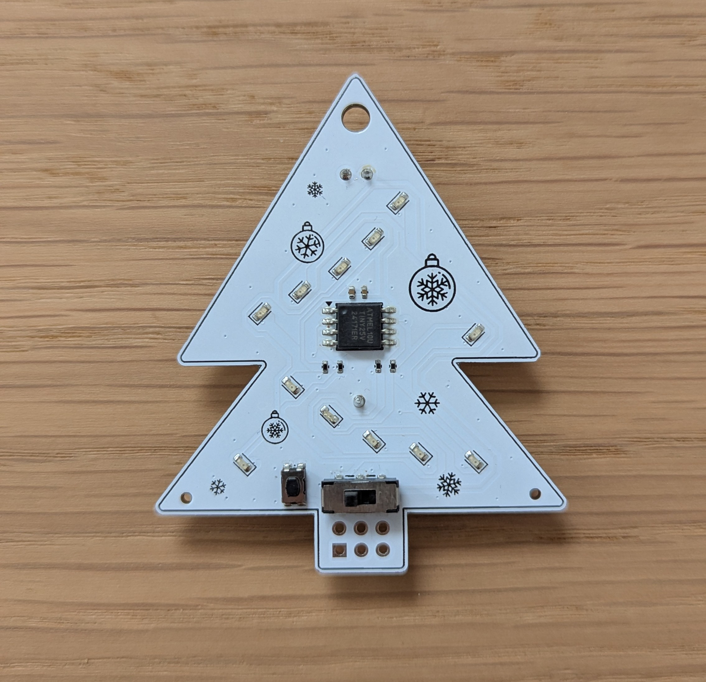
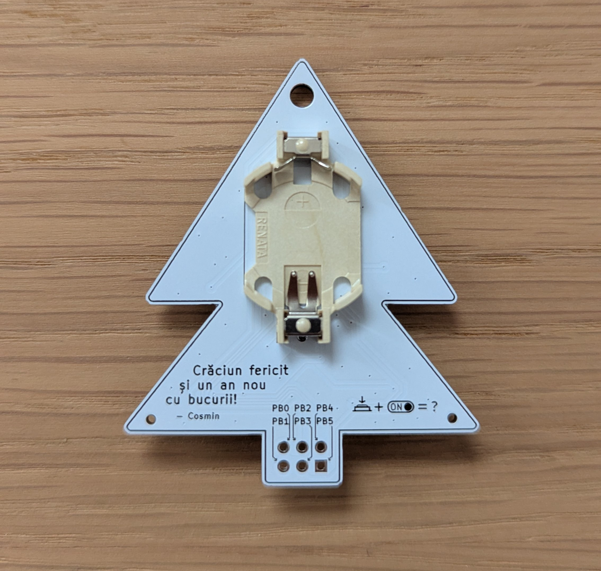

# ATtiny-powered Christmas Tree

## BOM

Designator | Footprint | Quantity | Details
---------- | --------- | -------- | -------
BT1 | Renata_HU2032LF | 1 | Renata 701106 holder for CR2032
C1 | 402 | 1 | Ceramic 100 nF
C2 | 402 | 1 | Ceramic 10 uF
D1, D11, D3, D5, D7, D9 | 603 | 6 | Osram LO L29K-J2L1-24-0-2-R18-Z
D10, D12, D2, D4, D6, D8 | 603 | 6 | Osram LY L29K-H1K2-26-0-2-R18-Z
R1, R2, R3, R4 | 402 | 4 | 150 Ω
SW1 | SW_Push_1P1T_NO_CK_KMR2 | 1 | C&K KMR421NGLFS
SW3 | SW_DPDT_CK_JS202011JCQN | 1 | C&K JS202011JCQN
U1 | SOIC-8_5.3x5.3mm_P1.27mm | 1 | ATtiny25V-10SU

## Photos

#### Image Licenses:
- <a href="https://www.flaticon.com/free-icons/ball" title="ball icons">Ball icons created by Good Ware - Flaticon</a>
- <a href="https://www.flaticon.com/free-icons/snowflake" title="snowflake icons">Snowflake icons created by Good Ware - Flaticon</a>
- <a href="https://www.flaticon.com/free-icons/snowflake" title="snowflake icons">Snowflake icons created by kmg design - Flaticon</a>
